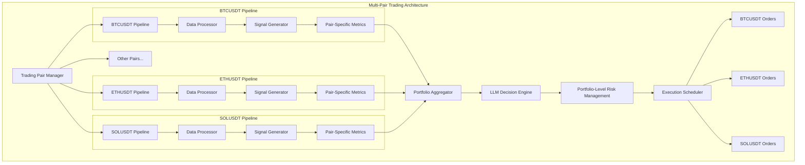

```mermaid
graph TD
    subgraph "Multi-Pair Trading Architecture"
        A[Trading Pair Manager] --> B1[BTCUSDT Pipeline]
        A --> B2[ETHUSDT Pipeline]
        A --> B3[SOLUSDT Pipeline]
        A --> B4[Other Pairs...]
        
        subgraph "BTCUSDT Pipeline"
            B1 --> C1[Data Processor]
            C1 --> D1[Signal Generator]
            D1 --> E1[Pair-Specific Metrics]
        end
        
        subgraph "ETHUSDT Pipeline"
            B2 --> C2[Data Processor]
            C2 --> D2[Signal Generator]
            D2 --> E2[Pair-Specific Metrics]
        end
        
        subgraph "SOLUSDT Pipeline"
            B3 --> C3[Data Processor]
            C3 --> D3[Signal Generator]
            D3 --> E3[Pair-Specific Metrics]
        end
        
        E1 --> F[Portfolio Aggregator]
        E2 --> F
        E3 --> F
        F --> G[LLM Decision Engine]
        G --> H[Portfolio-Level Risk Management]
        H --> I[Execution Scheduler]
        I --> J1[BTCUSDT Orders]
        I --> J2[ETHUSDT Orders]
        I --> J3[SOLUSDT Orders]
    end
```
