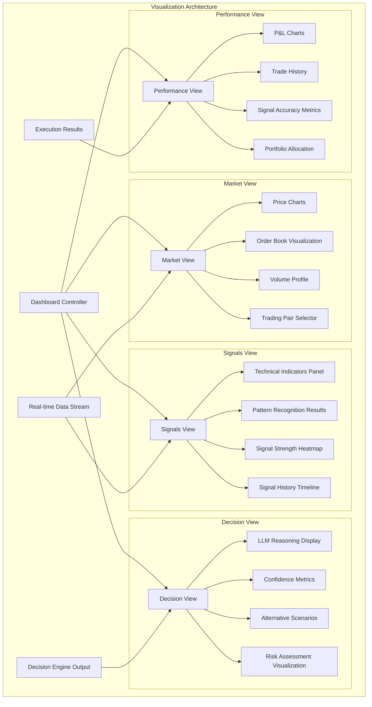

```mermaid
graph TD
    subgraph "Visualization Architecture"
        A[Dashboard Controller] --> B[Market View]
        A --> C[Signals View]
        A --> D[Decision View]
        A --> E[Performance View]
        
        subgraph "Market View"
            B --> B1[Price Charts]
            B --> B2[Order Book Visualization]
            B --> B3[Volume Profile]
            B --> B4[Trading Pair Selector]
        end
        
        subgraph "Signals View"
            C --> C1[Technical Indicators Panel]
            C --> C2[Pattern Recognition Results]
            C --> C3[Signal Strength Heatmap]
            C --> C4[Signal History Timeline]
        end
        
        subgraph "Decision View"
            D --> D1[LLM Reasoning Display]
            D --> D2[Confidence Metrics]
            D --> D3[Alternative Scenarios]
            D --> D4[Risk Assessment Visualization]
        end
        
        subgraph "Performance View"
            E --> E1[P&L Charts]
            E --> E2[Trade History]
            E --> E3[Signal Accuracy Metrics]
            E --> E4[Portfolio Allocation]
        end
        
        F[Real-time Data Stream] --> B
        F --> C
        G[Decision Engine Output] --> D
        H[Execution Results] --> E
    end
```
