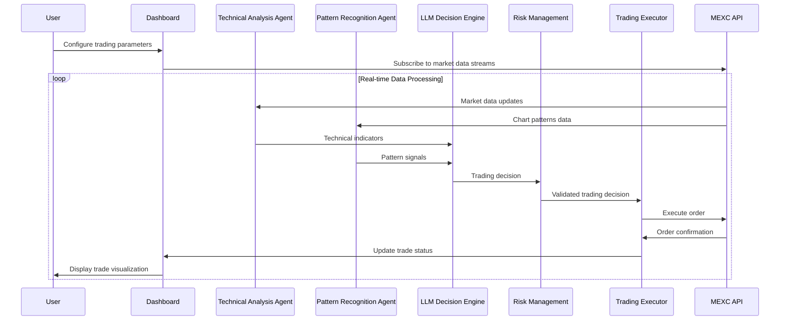

```mermaid
sequenceDiagram
    participant User
    participant Dashboard
    participant TA as Technical Analysis Agent
    participant PR as Pattern Recognition Agent
    participant LLM as LLM Decision Engine
    participant Risk as Risk Management
    participant Exec as Trading Executor
    participant MEXC as MEXC API

    User->>Dashboard: Configure trading parameters
    Dashboard->>MEXC: Subscribe to market data streams
    
    loop Real-time Data Processing
        MEXC->>TA: Market data updates
        MEXC->>PR: Chart patterns data
        
        TA->>LLM: Technical indicators
        PR->>LLM: Pattern signals
        
        LLM->>Risk: Trading decision
        Risk->>Exec: Validated trading decision
        
        Exec->>MEXC: Execute order
        MEXC->>Exec: Order confirmation
        
        Exec->>Dashboard: Update trade status
        Dashboard->>User: Display trade visualization
    end
```
