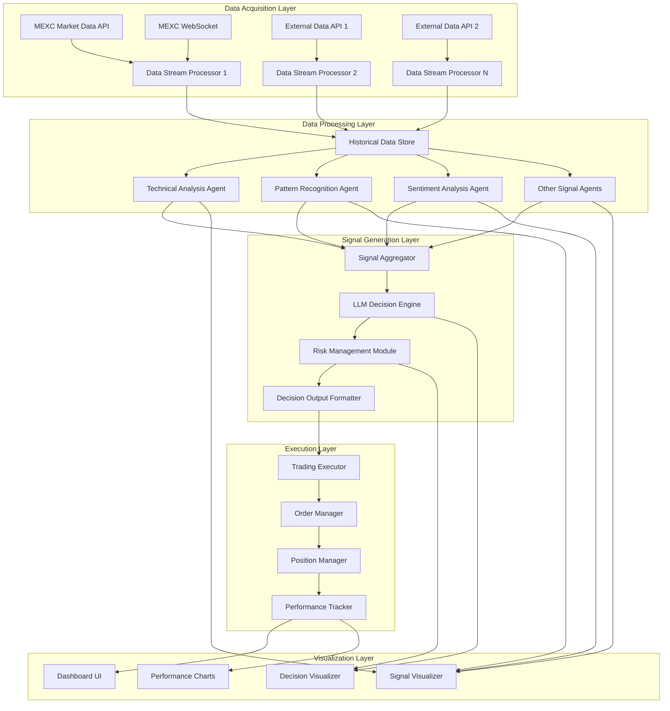

```mermaid
graph TD
    subgraph "Data Acquisition Layer"
        A1[MEXC Market Data API] --> B1[Data Stream Processor 1]
        A2[MEXC WebSocket] --> B1
        A3[External Data API 1] --> B2[Data Stream Processor 2]
        A4[External Data API 2] --> B3[Data Stream Processor N]
    end
    
    subgraph "Data Processing Layer"
        B1 --> C1[Historical Data Store]
        B2 --> C1
        B3 --> C1
        C1 --> D1[Technical Analysis Agent]
        C1 --> D2[Pattern Recognition Agent]
        C1 --> D3[Sentiment Analysis Agent]
        C1 --> D4[Other Signal Agents]
    end
    
    subgraph "Signal Generation Layer"
        D1 --> E1[Signal Aggregator]
        D2 --> E1
        D3 --> E1
        D4 --> E1
        E1 --> E2[LLM Decision Engine]
        E2 --> E3[Risk Management Module]
        E3 --> E4[Decision Output Formatter]
    end
    
    subgraph "Execution Layer"
        E4 --> F1[Trading Executor]
        F1 --> F2[Order Manager]
        F2 --> F3[Position Manager]
        F3 --> F4[Performance Tracker]
    end
    
    subgraph "Visualization Layer"
        F4 --> G1[Dashboard UI]
        D1 --> G2[Signal Visualizer]
        D2 --> G2
        D3 --> G2
        D4 --> G2
        E2 --> G3[Decision Visualizer]
        E3 --> G3
        F4 --> G4[Performance Charts]
    end
```
